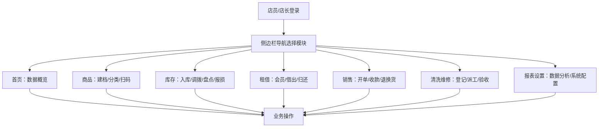

## 1. 产品概述
玩具门店综合管理系统，面向连锁玩具零售店的店长和店员，提供商品、库存、租借、销售、清洗维修、报表等全流程数字化管理能力。
- 核心目标：提升门店运营效率，降低库存损耗，优化会员服务体验
- 目标用户：门店店长（拥有全部权限）、门店店员（执行日常操作）
- 产品价值：统一管理商品生命周期，数据驱动经营决策

## 2. 核心功能

### 2.1 用户角色
| 角色 | 注册方式 | 核心权限 |
|------|----------|----------|
| 店长 | 总部统一分配 | 全部功能权限，含报表查看、系统设置、员工管理 |
| 店员 | 店长创建账号 | 商品/库存/租借/销售/清洗维修操作，无系统设置权限 |

### 2.2 功能模块
1. **首页**：数据概览卡片、待处理订单列表、低库存预警、逾期租借提醒
2. **商品管理**：商品建档、分类管理、扫码录入、图片上传、适龄段标注
3. **库存管理**：入库登记、门店调拨、库存盘点、报损处理、库存预警
4. **租借管理**：会员档案、押金管理、租借登记、归还处理、罚金计算
5. **销售管理**：销售开单、多种收款方式、退换货处理、销售记录查询
6. **清洗维修**：工单登记、状态跟踪、人员派工、验收确认
7. **报表设置**：热销/周转/利润报表、门店/员工/供应商/标签系统设置

### 2.3 页面详情
| 页面名称 | 模块名称 | 功能描述 |
|----------|----------|----------|
| 首页 | 数据概览卡片 | 今日销售额、在租数、库存总量、待处理工单等KPI展示 |
| 首页 | 待处理订单 | 展示待处理销售/租借/维修工单，支持快捷跳转 |
| 首页 | 低库存预警 | 显示库存低于安全线的商品列表 |
| 首页 | 逾期提醒 | 展示超期未归还的租借记录 |
| 商品页 | 商品列表 | 支持搜索、分类筛选、分页展示 |
| 商品页 | 商品建档 | 新增/编辑商品信息：名称、编码、分类、价格、适龄段、图片 |
| 商品页 | 扫码录入 | 模拟扫码枪快速查找/录入商品条码 |
| 商品页 | 分类管理 | 商品分类树的增删改操作 |
| 库存页 | 入库管理 | 采购入库单登记，关联供应商，更新库存 |
| 库存页 | 调拨管理 | 门店间库存调拨的发起和确认 |
| 库存页 | 盘点管理 | 创建盘点任务，录入实盘数，生成差异报告 |
| 库存页 | 报损管理 | 商品报损登记，原因记录，库存扣减 |
| 库存页 | 预警设置 | 安全库存阈值设置，自动预警提醒 |
| 租借页 | 会员管理 | 会员信息CRUD，会员等级，租借历史查看 |
| 租借页 | 押金管理 | 押金收取/退还记录，押金余额管理 |
| 租借页 | 借出登记 | 选择会员+商品+租期，生成租借单，收取押金 |
| 租借页 | 归还处理 | 扫码归还，检查商品状态，结算费用，退还押金 |
| 租借页 | 罚金管理 | 逾期/损坏自动计算罚金，支持减免 |
| 销售页 | 销售开单 | 扫码/搜索添加商品，自动计算金额，支持折扣 |
| 销售页 | 收款结算 | 支持现金/微信/支付宝/会员卡，打印小票 |
| 销售页 | 退换货 | 原单查询，退货/换货处理，库存回冲，退款 |
| 清洗维修页 | 工单登记 | 创建清洗/维修工单，记录问题描述，关联商品 |
| 清洗维修页 | 状态跟踪 | 工单状态流转（待处理→处理中→待验收→已完成） |
| 清洗维修页 | 派工管理 | 指派负责员工，设置预计完成时间 |
| 清洗维修页 | 验收确认 | 客户验收，签字确认，工单关闭 |
| 报表设置页 | 热销报表 | 商品销量排行，时间筛选，图表展示 |
| 报表设置页 | 周转报表 | 库存周转率、周转天数分析 |
| 报表设置页 | 利润报表 | 销售额、成本、毛利率趋势分析 |
| 报表设置页 | 门店设置 | 门店基础信息、营业时间维护 |
| 报表设置页 | 员工管理 | 员工账号、角色、权限管理 |
| 报表设置页 | 供应商管理 | 供应商信息、联系人、合作商品管理 |
| 报表设置页 | 标签管理 | 商品标签、会员标签自定义配置 |

## 3. 核心流程
**销售流程**：店员登录 → 进入销售页 → 扫码/搜索添加商品 → 确认数量和折扣 → 选择收款方式 → 完成收款 → 打印小票/记录保存

**租借流程**：会员到店 → 查询会员 → 选择租借商品 → 设定租期 → 计算租金和押金 → 收取费用 → 生成租借单 → 到期归还 → 检查商品 → 结算（含逾期罚金）→ 退还押金

**清洗维修流程**：客户送修 → 登记工单 → 店长派工 → 员工处理 → 状态更新 → 通知客户 → 验收确认 → 工单完成

## 4. 用户界面设计

### 4.1 设计风格
- **主色调**：玩具橙 (#FF6B35) + 活力蓝 (#1A73E8)，搭配中性灰 (#F5F7FA) 背景
- **辅助色**：成功绿 (#52C41A)、警告黄 (#FAAD14)、危险红 (#FF4D4F)
- **按钮风格**：圆角胶囊形按钮 (border-radius: 10px)，主按钮带微渐变
- **字体**：Noto Sans SC（中文友好），标题粗体 18-24px，正文常规 14px
- **布局风格**：左侧固定导航栏 + 右侧内容区，卡片式模块分组，顶部面包屑导航
- **图标风格**：Lucide React 线性图标，20px 尺寸，配色跟随语义

### 4.2 页面设计概述
| 页面名称 | 模块名称 | UI 元素 |
|----------|----------|----------|
| 首页 | 数据概览卡片 | 4个圆角卡片网格布局，渐变图标背景，数字动画，微悬浮效果 |
| 首页 | 列表模块 | 三栏卡片布局，左侧待处理订单(橙色边条)，中间低库存(红色)，右侧逾期(黄) |
| 商品页 | 列表+表单 | 左侧分类树，中间数据表格，右侧抽屉式新增/编辑表单 |
| 库存页 | Tab+表格 | 顶部5个Tab切换(入库/调拨/盘点/报损/预警)，每Tab独立操作区+表格 |
| 租借页 | 双栏布局 | 左侧会员信息卡+押金状态，右侧租借记录表格+快捷操作按钮 |
| 销售页 | POS风格 | 顶部搜索+商品分类快捷入口，中间购物车列表，底部结算金额+收款按钮组 |
| 清洗维修页 | 看板视图 | 4列看板(待处理/处理中/待验收/已完成)，卡片拖拽式状态流转 |
| 报表设置页 | 分区布局 | 上半部分Tab切换报表+图表，下半部分4个设置子模块卡片网格 |

### 4.3 响应式
- 桌面端优先设计（最小支持 1280px），侧栏固定宽度 240px
- 平板端（≥768px）：侧栏折叠为图标栏，悬停展开
- 移动端（<768px）：顶部汉堡菜单，内容区单列堆叠，表格转为卡片列表
