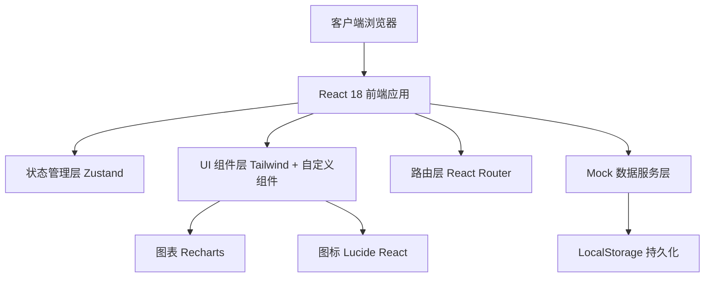
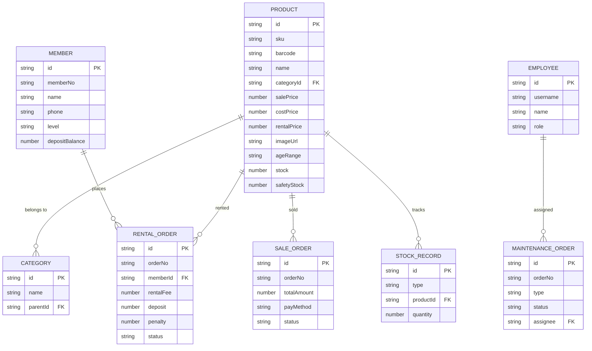

## 1. 架构设计


## 2. 技术描述
- **前端框架**：React 18 + TypeScript
- **构建工具**：Vite 5
- **样式方案**：Tailwind CSS 3 + CSS Variables 主题系统
- **路由管理**：React Router DOM 6
- **状态管理**：Zustand 4（全局状态）+ React Query 风格的自定义 hooks
- **UI 组件库**：自定义组件（基于 Tailwind），不引入重型 UI 库
- **图标库**：Lucide React
- **图表库**：Recharts
- **后端**：无真实后端，前端 Mock 数据 + LocalStorage 持久化模拟
- **数据存储**：LocalStorage（用户、商品、订单等数据）
- **包管理**：npm

## 3. 路由定义
| 路由 | 页面组件 | 页面用途 |
|------|----------|----------|
| `/` | Dashboard | 首页 - 数据概览、待处理、低库存、逾期提醒 |
| `/products` | Products | 商品管理 - 建档、分类、扫码、图片、适龄段 |
| `/inventory` | Inventory | 库存管理 - 入库、调拨、盘点、报损、预警 |
| `/rental` | Rental | 租借管理 - 会员、押金、借出、归还、罚金 |
| `/sales` | Sales | 销售管理 - 开单、收款、退换货 |
| `/maintenance` | Maintenance | 清洗维修 - 工单登记、派工、状态、验收 |
| `/reports` | Reports | 报表设置 - 热销/周转/利润报表 + 系统设置 |

## 4. API 定义（模拟层）
```typescript
// 通用响应结构
interface ApiResponse<T> {
  code: number;
  data: T;
  message: string;
}

// 商品相关
interface Product {
  id: string;
  sku: string;
  barcode: string;
  name: string;
  categoryId: string;
  categoryName: string;
  salePrice: number;
  costPrice: number;
  rentalPrice: number;
  imageUrl: string;
  ageRange: string; // 如 3-6岁, 6-12岁
  tags: string[];
  stock: number;
  safetyStock: number;
  status: 'active' | 'inactive';
  createdAt: string;
}

// 库存相关
interface StockRecord {
  id: string;
  type: 'inbound' | 'transfer' | 'stocktake' | 'damage';
  productId: string;
  productName: string;
  quantity: number;
  beforeStock: number;
  afterStock: number;
  relatedOrderNo: string;
  operator: string;
  remark: string;
  createdAt: string;
}

// 会员相关
interface Member {
  id: string;
  memberNo: string;
  name: string;
  phone: string;
  level: 'normal' | 'silver' | 'gold' | 'platinum';
  depositBalance: number;
  totalRentals: number;
  status: 'active' | 'frozen';
  joinDate: string;
}

// 租借相关
interface RentalOrder {
  id: string;
  orderNo: string;
  memberId: string;
  memberName: string;
  items: { productId: string; productName: string; quantity: number }[];
  rentalDays: number;
  startDate: string;
  dueDate: string;
  returnDate?: string;
  rentalFee: number;
  deposit: number;
  penalty: number;
  status: 'pending' | 'active' | 'overdue' | 'returned' | 'completed';
  operator: string;
  createdAt: string;
}

// 销售相关
interface SaleOrder {
  id: string;
  orderNo: string;
  items: { productId: string; productName: string; quantity: number; price: number; discount: number }[];
  subtotal: number;
  discountAmount: number;
  totalAmount: number;
  payMethod: 'cash' | 'wechat' | 'alipay' | 'member';
  memberId?: string;
  status: 'paid' | 'returned' | 'exchanged';
  operator: string;
  createdAt: string;
}

// 清洗维修相关
interface MaintenanceOrder {
  id: string;
  orderNo: string;
  type: 'clean' | 'repair';
  productId?: string;
  productName?: string;
  description: string;
  assignee?: string;
  status: 'pending' | 'processing' | 'checking' | 'completed';
  expectedDate?: string;
  customerName?: string;
  customerPhone?: string;
  operator: string;
  createdAt: string;
  completedAt?: string;
}

// 设置相关
interface Store {
  id: string;
  name: string;
  address: string;
  phone: string;
  businessHours: string;
}

interface Employee {
  id: string;
  username: string;
  name: string;
  role: 'manager' | 'staff';
  phone: string;
  status: 'active' | 'inactive';
}

interface Supplier {
  id: string;
  name: string;
  contact: string;
  phone: string;
  products: string[];
}

interface Tag {
  id: string;
  name: string;
  type: 'product' | 'member';
  color: string;
}
```

## 5. 数据模型

### 5.1 实体关系图


### 5.2 初始 Mock 数据（LocalStorage 初始化）
- **商品**：预置 50+ 条玩具商品，覆盖 5 大分类（积木、益智、毛绒、遥控、户外），各年龄段
- **分类树**：5 个一级分类，每个分类下 2-3 个子分类
- **会员**：15 个示例会员，含不同等级和押金余额
- **销售订单**：最近 30 天 100 条历史订单
- **租借订单**：20 条活跃/逾期记录，50 条历史记录
- **库存记录**：入库/调拨/报损等流水记录
- **维修工单**：8 条不同状态的清洗维修工单
- **员工**：店长 1 名 + 店员 3 名
- **供应商**：5 家示例供应商
- **标签**：商品标签 10 个 + 会员标签 5 个
